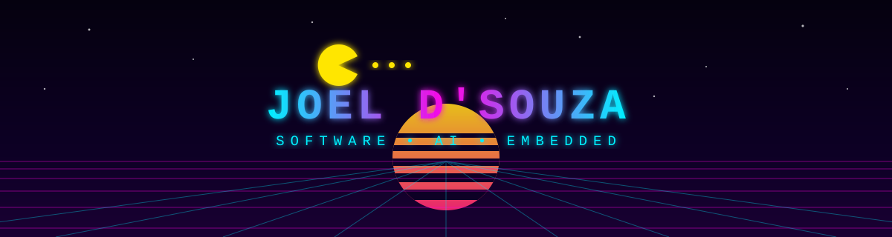

I learn best by building things, breaking them, debugging them, and rebuilding them better.

---

## ▸ ABOUT ME

Computer Science & Engineering student building at the intersection of **software, AI, and embedded systems** — interested in useful, intelligent systems that solve real-world problems, not technology for its own sake.

- 🤖 Building **AI agents** with persistent memory, tool use, and multi-agent delegation
- 🔌 Prototyping **embedded/IoT** hardware with ESP32, sensors, and haptics
- 📱 Shipping **Android & web** apps with Kotlin, Jetpack Compose, and Supabase
- ⚡ Exploring how software and AI can support a **sustainable energy future**

---

## ▸ NEON ARCADE 🕹️

**🎮 INSERT COIN → [PLAY NEON ARCADE](https://hotwings06.github.io/neon-arcade/)** — a 198X retro arcade built with HTML5 Canvas

*Pac-Man eating my contribution graph, regenerated daily by GitHub Actions:*

<!-- pacman -->
<picture>
  <source media="(prefers-color-scheme: dark)" srcset="https://raw.githubusercontent.com/HoTWinGs06/HoTWinGs06/output/pacman-contribution-graph-dark.svg">
  
</picture>

<!-- breakout -->
<picture>
  <source media="(prefers-color-scheme: dark)" srcset="https://raw.githubusercontent.com/HoTWinGs06/HoTWinGs06/output/breakout-contribution-graph-dark.svg">
  
</picture>

---

## ▸ PROJECTS

| Project | What it is | Stack |
|---|---|---|
| 🤖 **Hermes — Personal AI Agent** | Evolving agent system: persistent memory, personas, multi-agent delegation, Git-isolated autonomous workflows, failure recovery | Python, LLMs, Obsidian |
| 🕹️ **[Neon Arcade](https://github.com/HoTWinGs06/neon-arcade)** · [▶ play](https://hotwings06.github.io/neon-arcade/) | 198X retro arcade game | HTML5 Canvas, JS |
| 🔍 **[autonomous-pr-reviewer](https://github.com/HoTWinGs06/autonomous-pr-reviewer)** | AI bot for automated PR reviews with sandboxed linters | Python, GitHub API |
| 🦯 **Smart Walking Stick** | Assistive-tech prototype: multi-sensor obstacle detection with vibration feedback | ESP32, VL53L0X, HC-SR04, I²C, C/C++ |
| 🎓 **Campus Connect** | Platform for connecting students and improving campus interaction | Kotlin, Jetpack Compose, Material 3, Supabase |
| ⚡ **Energy & Sustainability** | Smart energy management, renewable energy, solar communities, energy dashboards | Mixed |

---

## ▸ TECH STACK

 

 

---

## ▸ CURRENTLY LEARNING

- Data structures & algorithms
- Software engineering & system design
- AI/ML concepts & multi-agent systems
- Advanced embedded systems
- Backend & cloud technologies

---

## ▸ LEADERSHIP

**Treasurer — IEEE Power & Energy Society (student chapter)**
Organized and managed technical events: competitions, frontend development events, and energy & sustainability events. Budget planning, participant coordination, technical evaluation, and documentation.

---

## ▸ GITHUB STATS

---

## ▸ LET'S CONNECT

Open to collaborating on **AI & agent systems**, **embedded/IoT**, **sustainability tech**, and **open-source / hackathons**.

<!-- add more when ready, e.g.:

-->

*If you're building something interesting, feel free to reach out.*

**GAME OVER — INSERT COIN TO CONTINUE** ▮

